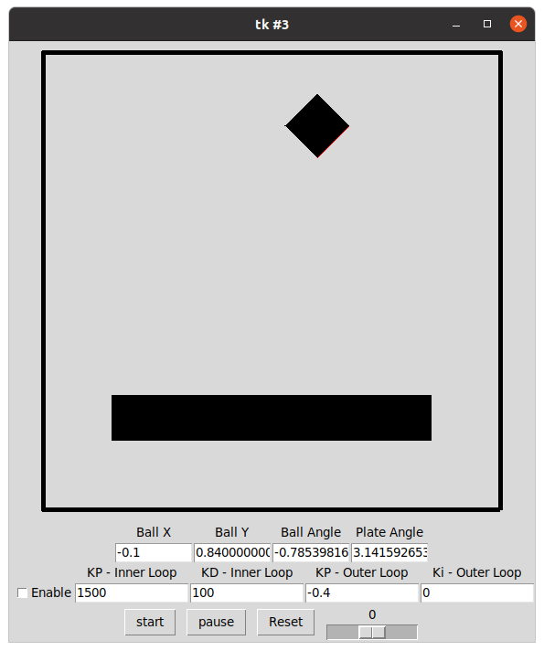
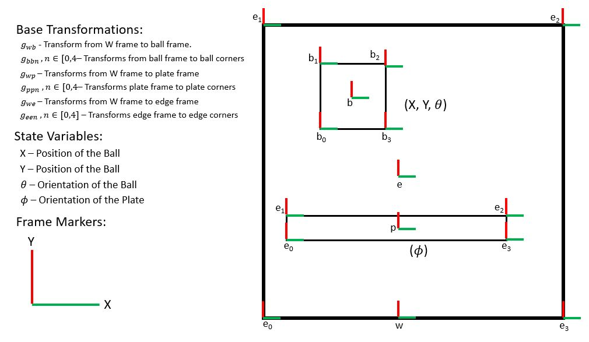

# ME314 Final Project
This is the git repo for my ME314 final project. The program simulates a square
ball bouncing on a tilting platform in 2D using legrangian mechanics.  

The system will run in near-realtime on most computers, although the collisions
may take several seconds to execute.

A video of the system running can be found at: https://youtu.be/3ByWvNWflTY



## Instructions
The simulator runs as a Tkinter GUI and has been tested using python 3.8 under
Ubuntu 20.04. 


### Install
Clone this repo onto your machine, and then install the following dependencies.
```
pip3 install sympy
pip3 install numpy
pip3 install simple-pid
```

### Documentation
The code is commented for doxygen. 

### Use
Run the simulator from the command line as follows. The default starting 
paramiters can be eddited in main.py, or you can change them from the GUI
before each run. 
```
python3 main.py
```
The "start", "Pause", and "Reset" buttons work as you would expect. In general 
it is better to pause before resetting, although it will generally not be an 
issue. 

To edit any of the system paramiters pause the simulation and then change the 
appropriate entry box in the GUI. 

To change the wind value move the slider to the right of the "Reset" button. 

To enable the plate controller select the "Enable" checkbox. The existing 
controller paramiters should stabalize the ball in the center of the bar.

### Known Bugs

At very high speeds the ball can pass through the walls. This condition should
never occur during normal operations. 

The system will sometimes aquire a new default position if the reset button is 
pressed during a collision. 

## System Layout
The system's transforms and frames are defined as shown below.


### Controller
The program uses a 3 tier cascade controller as shown below to stabalize the 
ball's bouncing 
in the center of the plate. The inner most controller apply's a torque to set
the plate's angle, the middle tier changes the plate's target angle to set the
ball's horizontal velocity, and the outermost controller changes the horizontal
velocity setpoint to move the ball to the plate's center. This architecture was
chosen because it is easy to tune.


